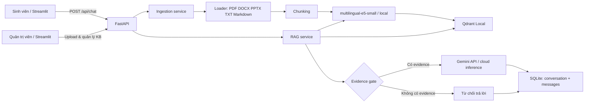

# Trợ Lý Rô AI — RAG Chat Assistant

> Hỏi tài liệu, Rô tìm giúp bạn.

Ứng dụng hỏi đáp tài liệu cho bối cảnh học tập và bài midterm **Build a RAG Chatbot**. Knowledge Base nộp bài là `data/documents/KB-A_Lumen-Institute-Student-Handbook.md`; người dùng đặt câu hỏi bằng tiếng Việt và nhận câu trả lời có nguồn. Hệ thống dùng RAG (Retrieval-Augmented Generation): **truy xuất evidence trước, chỉ sau đó mới gọi Gemini để sinh câu trả lời**.

Đồ án **không train/fine-tune LLM**. Tài liệu được *index* thành vectors để truy xuất khi người dùng hỏi.

## Mục tiêu và phạm vi

- **Sinh viên:** chọn tài liệu, chat với Rô, xem nguồn và lịch sử hội thoại.
- **Quản trị viên:** thêm, đổi tên, re-index, xóa tài liệu; xem trace retrieval để kiểm tra chất lượng trả lời.
- **Closed-domain RAG:** thiếu evidence trong tài liệu đã chọn thì từ chối, không cố trả lời theo kiến thức ngoài KB.
- Hỗ trợ PDF, DOCX, PPTX, TXT và Markdown; Markdown Handbook giữ metadata Section thật khi chunking.

`Sinh viên` và `Quản trị viên` hiện là **role mô phỏng giao diện** phục vụ demo. Đây chưa phải đăng nhập/RBAC bảo mật thật; triển khai thật phải xác thực người dùng và kiểm tra quyền tại mỗi API backend.

## Kiến trúc hệ thống



### Luồng index tài liệu

```text
Admin upload / data/documents
→ FastAPI documents route
→ document_loader đọc nội dung + metadata trang/slide
→ chunking chia đoạn nhỏ
→ E5 local tạo vector cho từng `passage:`
→ Qdrant lưu vector + text + filename + location + chunk index
→ SQLite đánh dấu document READY
```

### Luồng một câu hỏi RAG

```text
Sinh viên chọn tài liệu + gửi câu hỏi
→ chat API
→ E5 local tạo vector `query:`
→ Qdrant tìm Top-K chunks, filter theo document ID đã chọn
→ evidence gate
→ Gemini nhận question + Top-K evidence + lịch sử gần
→ answer + citations
→ SQLite lưu messages và Streamlit hiển thị kết quả
```

## Công nghệ sử dụng

| Thành phần | Công nghệ | Vai trò |
|---|---|---|
| Ngôn ngữ | Python | Toàn bộ ứng dụng |
| Frontend | Streamlit | UI role Sinh viên/Admin, upload, chat, debug |
| Backend | FastAPI + Uvicorn | API và điều phối dịch vụ |
| PDF loader | PyMuPDF | Đọc PDF, giữ số trang |
| DOCX loader | python-docx | Đọc Word |
| PPTX loader | python-pptx | Đọc slide, giữ số slide |
| Chunking | LangChain RecursiveCharacterTextSplitter | `CHUNK_SIZE=900`, `CHUNK_OVERLAP=150`; không trộn section Markdown |
| Embedding | `intfloat/multilingual-e5-small` | Tạo vector tiếng Việt/đa ngôn ngữ, chạy local |
| Vector database | Qdrant Local | Lưu/tìm Top-K vectors |
| Generation LLM | Gemini API | Sinh câu trả lời từ evidence |
| Chat history | SQLite | Lưu conversation, message, citation |
| Testing | pytest | Kiểm tra chức năng chính |

## Cấu trúc thư mục

```text
RAG_Assistant/
├── frontend/streamlit_app.py       # UI và gọi FastAPI, không có API key
├── app/
│   ├── main.py                     # FastAPI app và routers
│   ├── api/chat.py                 # Chat + conversations
│   ├── api/documents.py            # Upload/list/rename/delete/re-index
│   ├── api/debug.py                # Trace debug an toàn
│   ├── core/config.py              # .env, paths, model IDs, limits
│   ├── db/database.py              # SQLite documents/conversations/messages
│   ├── schemas.py                  # Request/response schema
│   └── services/
│       ├── document_loader.py      # Parse 4 định dạng
│       ├── chunking.py             # Clean/split, giữ metadata
│       ├── embedding_service.py    # E5 local query/passage embedding
│       ├── vector_store.py         # Qdrant add/search/filter/delete
│       ├── ingestion_service.py    # Loader → chunk → E5 → Qdrant
│       ├── rag_service.py          # Retrieval, evidence gate, citations
│       ├── llm_service.py          # Gemini generate_content()
│       ├── history_service.py      # Lưu conversation/message
│       └── evaluation_service.py   # Evaluation cases
├── data/documents/                 # Tài liệu mẫu/hard-coded để index batch
├── data/uploads/                   # File upload gốc (gitignore)
├── data/qdrant/                    # Vector database local (gitignore)
├── data/database/                  # SQLite local (gitignore)
├── models/                         # Model E5 local cache (gitignore)
├── scripts/index_documents.py      # Index cả data/documents
├── tests/                          # pytest + evaluation dataset
├── docs/                           # Kịch bản demo và tài liệu vấn đáp
├── output/pdf/                     # PDF kiến trúc để ôn thi
├── .env.example                    # Mẫu cấu hình, không chứa secret
└── requirements.txt
```

## Cài đặt và chạy trên Windows

### 1. Clone source

```powershell
git clone https://github.com/nhivan2405/Documents_Rag_chat.git
cd Documents_Rag_chat
```

### 2. Tạo môi trường Python và cài thư viện

```powershell
python -m venv .venv
.\.venv\Scripts\Activate.ps1
python -m pip install --upgrade pip
pip install -r requirements.txt
```

### 3. Tạo cấu hình

```powershell
Copy-Item .env.example .env
```

Mở `.env`, điền `GEMINI_API_KEY`, và đặt `GEMINI_MODEL` là model khả dụng trong tài khoản. Không commit `.env`.

Model E5 phải được tải/cached local trước demo, vì code dùng `local_files_only=True`; thiếu model thì app báo lỗi thay vì tự tải lúc upload.

### 4. Chạy backend

Mở PowerShell thứ nhất:

```powershell
.\.venv\Scripts\python.exe -m uvicorn app.main:app --host 127.0.0.1 --port 8123
```

Nếu Windows báo `WinError 10013`, không thêm `--reload`.

### 5. Chạy giao diện

Mở PowerShell thứ hai:

```powershell
.\.venv\Scripts\python.exe -m streamlit run frontend\streamlit_app.py
```

Mở URL Streamlit hiện trong terminal, thường là `http://localhost:8501`.

### 6. Chạy test

```powershell
.\.venv\Scripts\python.exe -m pytest tests -q -p no:cacheprovider
```

### 7. Index Knowledge Base Lumen

Đặt đúng file `KB-A_Lumen-Institute-Student-Handbook.md` trong `data/documents`, sau đó chạy:

```powershell
.\.venv\Scripts\python.exe scripts\index_documents.py
```

Hoặc vào trang **Tài liệu của tôi** và chọn **Index thư mục documents**. Khi chat, chỉ chọn tài liệu Lumen READY. Trang **Kiểm tra câu trả lời** hiển thị câu hỏi retrieval, Top-K chunks, score, filename, Section, chunk ID và text thật.

### Lưu ý kiểm chứng

Test offline chỉ kiểm tra loader, metadata section và evidence gate. Index E5/Qdrant và generation Gemini cần chạy trong môi trường có E5 đã cache cùng `GEMINI_API_KEY` hợp lệ; không coi test mock/offline là bằng chứng hai dịch vụ đó hoạt động.

## Kịch bản demo trong 3–5 phút

1. Chọn **Quản trị viên** ở sidebar.
2. Mở **Quản lý tài liệu**, upload DOCX/PDF nhỏ hoặc index thư mục `data/documents`.
3. Chờ trạng thái `READY`; nói: `extract → chunk → E5 → Qdrant`.
4. Chọn **Sinh viên**, mở **Hỏi Rô**, chọn tài liệu `READY` và hỏi câu chắc chắn có trong tài liệu.
5. Chỉ citation dưới câu trả lời để chứng minh nguồn.
6. Hỏi câu không có trong tài liệu hoặc bỏ chọn tài liệu để chứng minh evidence gate từ chối.
7. Chuyển Admin, mở **Kiểm tra câu trả lời** để chỉ Top-K, score, filename và chunk thật.
8. Hỏi câu tiếp theo, refresh hoặc mở lịch sử chat để chứng minh SQLite lưu hội thoại.

## Code cần mở khi vấn đáp

| Câu hỏi | File cần mở | Điều cần trả lời |
|---|---|---|
| Upload đi đâu? | `app/api/documents.py` → `ingestion_service.py` | Route nhận file; service điều phối toàn pipeline. |
| Embedding chạy thế nào? | `embedding_service.py` | E5 local; `passage:` cho chunk, `query:` cho câu hỏi; `encode()` trả vector. |
| Tại sao normalize? | `embedding_service.py` | Vector độ dài 1, so cosine ổn định hơn. |
| Qdrant làm gì? | `vector_store.py` | Lưu vector/payload; search Top-K, filter document ID. |
| Chặn hallucination ở đâu? | `rag_service.py` | Evidence gate: không chunk thì dừng trước Gemini. |
| Gemini ở đâu? | `llm_service.py` | `client.models.generate_content(...)` là cloud generation inference. |
| Model ID lấy từ đâu? | `.env` → `config.py` | Không hard-code model/key trong UI hay service. |
| Lịch sử lưu ở đâu? | `database.py`, `history_service.py` | SQLite lưu conversations/messages/citations. |

Tài liệu ôn chi tiết:

- [`docs/11_GIAO_TRINH_DOC_CODE_TUNG_DONG.md`](docs/11_GIAO_TRINH_DOC_CODE_TUNG_DONG.md): giải thích code theo luồng và cú pháp.
- [`docs/09_KICH_BAN_DEMO_UI_XUONG_CODE.md`](docs/09_KICH_BAN_DEMO_UI_XUONG_CODE.md): demo từ UI xuống code.
- [`docs/12_KICH_BAN_UNG_BIEN_KNOWLEDGE_BASE_KHI_THI.md`](docs/12_KICH_BAN_UNG_BIEN_KNOWLEDGE_BASE_KHI_THI.md): xử lý câu hỏi mở rộng về Knowledge Base.
- [`output/pdf/RO_AI_KIEN_TRUC_HE_THONG_VA_CONG_NGHE.pdf`](output/pdf/RO_AI_KIEN_TRUC_HE_THONG_VA_CONG_NGHE.pdf): tóm tắt kiến trúc và công nghệ.

## Dữ liệu GitHub

Đã đưa lên: source code, `.env.example`, tests, scripts, tài liệu demo/vấn đáp, PDF kiến trúc và `data/documents/RAG.docx` là tài liệu mẫu.

Không đưa lên: `.env` chứa API key, `.venv`, `models/`, `data/qdrant/`, `data/database/*.db`, `data/uploads/`, cache IDE/test và `app.zip`. Các mục này bị ignore vì chứa bí mật, là dữ liệu sinh ra khi chạy hoặc làm repository nặng.

Sau khi clone sang máy/thư mục mới: tạo `.env`, cài thư viện, chuẩn bị cache E5 và index lại tài liệu. GitHub tin cậy hơn ZIP vì có lịch sử commit và có thể quay lại phiên bản cũ.
