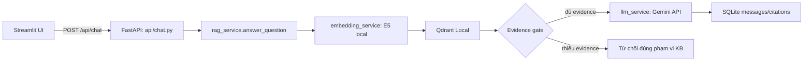

# Kiến trúc và luồng code

## Câu trả lời ngắn khi vấn đáp

- `EmbeddingService.embed_query()` chạy **embedding inference local**: biến câu hỏi thành vector số; không tạo câu trả lời.
- `generate_answer()` trong `app/services/llm_service.py` gọi `client.models.generate_content(...)`: đó là **generation inference** trên hạ tầng Google, dùng model lấy từ `.env`.
- Đổi embedding model phải re-index vì vector dimension/không gian ngữ nghĩa có thể khác. Đổi Gemini thường không phải re-index.
- Citation đi từ metadata loader → chunk payload Qdrant → `Evidence` → UI; LLM không tự tạo số trang/slide.

