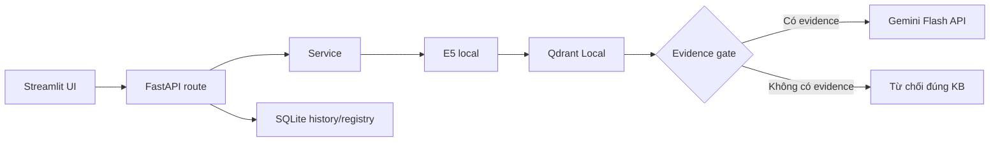

# Kịch bản demo: UI → API → code

Tài liệu này dùng khi thầy bấm một chức năng và yêu cầu chỉ xuống code. Mỗi hàng là một đường đi có thể mở theo thứ tự từ trái sang phải.

## Sơ đồ tổng quát

## 1. Demo chat

### Bạn thao tác

1. Mở **Trò chuyện**.
2. Chỉ ô chọn “Tài liệu dùng để trả lời”. Nói: “Filter document ID đi đến Qdrant, nên tài liệu không chọn không được dùng.”
3. Khi KB chưa có tài liệu, chỉ thông báo KB trống. Đây là kết quả đúng, không phải lỗi giao diện.
4. Gõ câu hỏi (nếu backend chạy). Khi không có selected document ID, hệ thống yêu cầu chọn tài liệu; Gemini không được gọi.

### Mở code theo thứ tự

| Điểm bấm/hiển thị | File : hàm / đoạn | Điều phải nói |
|---|---|---|
| Ô chat | `frontend/streamlit_app.py` : `st.chat_input` | UI nhận text, không có API key/model ở đây. |
| Gọi backend | `frontend/streamlit_app.py` : `api_request('/chat', ...)` | JSON gồm question, selected document IDs, conversation ID. |
| HTTP endpoint | `app/api/chat.py` : `chat()` | FastAPI nhận/validate `ChatRequest`, lấy history gần. |
| RAG | `app/services/rag_service.py` : `answer_question()` | Đây là orchestration, không phải LLM. |
| Query embedding | `app/services/embedding_service.py` : `embed_query()` | Prefix `query:`, `encode()`, normalize; inference local. |
| Retrieval | `app/services/vector_store.py` : `search()` | Top-K cosine + filter `document_id`. Score không phải xác suất đúng. |
| Gate | `app/services/rag_service.py` : `if not retrieved` | Thiếu evidence → từ chối trước Gemini. |
| Generation | `app/services/llm_service.py` : `generate_answer()` | `generate_content()` là Gemini generation inference cloud. |
| Lưu lịch sử | `app/services/history_service.py` : `save_turn()` | Ghi user/assistant/citations vào SQLite. |

## 2. Demo Admin KB / Tài liệu

PDF nhóm mô tả giao diện “Admin KB”, hàng pipeline và trạng thái `READY/PROCESSING`. Trong ứng dụng này tương ứng trang **Tài liệu của tôi**.

### Bạn thao tác

1. Mở **Tài liệu của tôi**.
2. Đọc pipeline hiển thị: `PDF/DOCX/PPTX/TXT → extract → chunk → E5 → Qdrant → READY`.
3. Nói rõ upload đang không chạy trong demo nếu chưa có Knowledge Base, để không tải model E5 lần đầu và không sinh dữ liệu giả.
4. Nếu thầy hỏi “bấm upload thì chạy gì?”, mở code bên dưới, không cần bấm thực.

### Mở code theo thứ tự

| Giai đoạn PDF | Code | Input → output | Câu trả lời vấn đáp |
|---|---|---|---|
| Upload | `app/api/documents.py` : `upload()` | HTTP file → temporary path | Kiểm path filename, không tin dữ liệu người dùng. |
| Validate | `app/services/ingestion_service.py` : đầu `index_file()` | path → extension/size/hash hợp lệ | Chặn file rỗng, quá lớn, extension sai; hash chống trùng. |
| Processing | `app/db/database.py` : `create_document()` | metadata → row PROCESSING | UI không hiển thị READY sớm. |
| Loader | `app/services/document_loader.py` : `extract_document()` | file → units text/location | PyMuPDF giữ trang PDF; python-docx/PPTX giữ dạng nguồn. |
| Clean/chunk | `app/services/chunking.py` : `clean_text`, `split_units` | unit → chunks/payload | `RecursiveCharacterTextSplitter` ưu tiên ngắt đoạn/câu; size là ký tự, overlap giữ ý ở boundary. |
| Embed | `app/services/embedding_service.py` : `embed_passages()` | `passage: chunk` → vector | E5 local embedding inference; không phải answer generation. |
| Upsert | `app/services/vector_store.py` : `upsert()` | vectors/payload → Qdrant points | payload có filename/location/document ID để citation/filter. |
| Ready | `app/services/ingestion_service.py` : `set_document_status` | upsert success → READY | Upsert fail thì FAILED, không có vector dở dang mang nhãn READY. |

## 3. Demo RAG Debug

### Bạn thao tác

1. Mở **Kiểm tra câu trả lời**.
2. Chỉ `Embedding model`, `Generation model`, `Top-K`, trạng thái Gemini configured và số tài liệu READY.
3. Nói: “Ở lần chạy có KB, trang này phải lấy trace thật: query, Top-K score, filename/page/slide, context đã gửi. Không dùng metric hard-code.”

### Mở code

`frontend/streamlit_app.py` gọi `GET /api/debug/configuration` → `app/api/debug.py` → `app/core/config.py`. `Settings` là một nguồn cấu hình duy nhất, đọc `.env`; endpoint không trả `GEMINI_API_KEY`.

## 4. Chat mới và lịch sử

1. Bấm **Chat mới**.
2. Mở `frontend/streamlit_app.py`: gọi `POST /api/conversations`, reset messages hiển thị.
3. Mở `app/api/chat.py`: `create_conversation()`.
4. Mở `app/db/database.py`: bảng `conversations`; khi gửi chat thì `messages` lưu `role/content/citations_json`.
5. Câu nói: “Chat mới không xóa Qdrant hoặc documents. Nó chỉ tạo conversation ID khác để không lẫn lịch sử.”

## 5. Trả lời khi bị hỏi model

### “Dùng model ở đâu?”

- Embedding: `app/services/embedding_service.py`, `_load()` gọi `SentenceTransformer(settings.embedding_model)`; `embed_passages()` / `embed_query()` gọi `model.encode()`.
- Gemini: `app/services/llm_service.py`, `generate_answer()` tạo `genai.Client` và gọi `client.models.generate_content(model=settings.gemini_model, ...)`.
- Cấu hình model: `.env` → `app/core/config.py` → object `settings`.

### “Mô hình chạy ở đâu, inference là gì?”

- E5 chạy local trong Python backend, trên CPU/GPU của máy đang chạy app. `encode()` biến text thành vector; đó là embedding inference.
- Gemini Flash-Lite chạy trên hạ tầng Google. Backend gửi context Top-K + question qua API; `generate_content()` sinh text; đó là generation inference.
- Không gửi toàn bộ PDF cho Gemini, chỉ gửi evidence; tiết kiệm token, nhanh hơn và citation kiểm tra được.

### “Tại sao E5-small mà PDF mockup ghi BGE-M3?”

PDF là thiết kế/mẫu luồng, không phải bắt buộc model. Chọn `intfloat/multilingual-e5-small` cho demo vì nhẹ, đa ngôn ngữ, chạy local và dễ giải thích prefix `query:`/`passage:`. BGE-M3 mạnh và linh hoạt hơn nhưng nặng hơn, tăng thời gian tải/RAM và rủi ro ngày thi. Cả hai phải re-index khi đổi model. Không được nói BGE-M3 đang chạy nếu `Settings.embedding_model` đang là E5.

### “Tại sao Gemini Flash-Lite, không phải GPT/Claude/local LLM?”

Gemini Flash-Lite là baseline API nhẹ để máy không cần VRAM lớn. GPT/Claude có thể mạnh ở vài tác vụ nhưng là provider khác/chi phí/quota khác. LLM local như Qwen/Ollama cần RAM/VRAM và setup lớn hơn. Chọn theo mục tiêu demo ổn định và yêu cầu RAG, không nói model này tốt nhất tuyệt đối. Model ID/quota phải kiểm tra trong tài khoản thật trước khi demo có generation.

## 6. Câu chốt nếu chưa có KB

> “Phần khung đã cho thấy ranh giới và luồng code. Dữ liệu Knowledge Base là input thay đổi theo đề tài; khi có file thật tôi index bằng cùng pipeline. Khi chưa có evidence, hệ thống từ chối thay vì hallucinate. Vì vậy demo hiện tại trung thực và đúng nguyên tắc RAG.”
